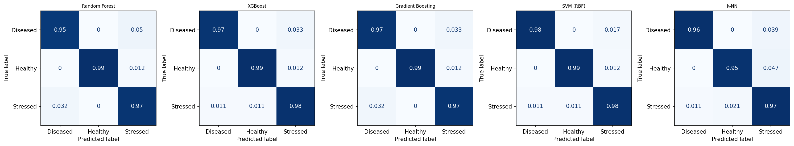
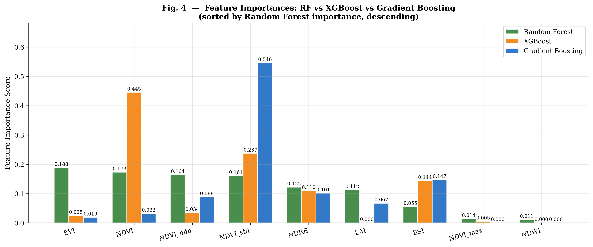

# AgroSense — Pakistan Crop Stress Classification

**Satellite-based spectral proxy classification for Pakistani agriculture using Sentinel-2 and Google Earth Engine.**

[](LICENSE)
[](https://python.org)
[](https://developers.google.com/earth-engine/datasets/catalog/COPERNICUS_S2_SR_HARMONIZED)

---

## Overview

AgroSense classifies Sentinel-2 observations of Pakistani agricultural fields into
spectrally derived crop-condition proxy classes — **Healthy**, **Stressed**, and
**Diseased** — using nine spectral features (six derived indices and three temporal
NDVI statistics).

> **⚠ Label disclosure:** The three class labels are generated from a vegetation
> health composite (0.5·NDVI + 0.3·NDRE + 0.2·EVI) via tertile split. Since NDVI,
> NDRE, and EVI are also model input features, classifiers partly learn the rule that
> created the labels. Reported accuracy is an **upper bound for spectral separability**,
> not independently validated crop disease detection. See
> [`docs/dataset_description.md`](docs/dataset_description.md) for full details.

| Metric | Value |
|---|---|
| Dataset size | 1,786 real Sentinel-2 observations |
| Field sites | 116 sites across 4 provinces |
| Seasons | 10 growing seasons (2015–2024) |
| Best test accuracy | SVM (RBF) — **98.34%** (field-grouped split) |
| Best CV macro F1 | XGBoost — **0.983** (StratifiedGroupKFold, 5 folds) |
| Evaluation method | GroupShuffleSplit on `location_id` — no field leakage |
| Classes | Healthy / Stressed / Diseased |

This repository is the replication package for the paper:

> **"AgroSense: Satellite-Based Crop Stress Classification and Smart Farming Decision Support for Pakistan Smallholder Agriculture"**
> Ali Shahmeer, 2026.

---

## Repository Structure

```
agrosense-pakistan-crop-stress/
├── README.md
├── LICENSE                              # MIT
├── CITATION.cff                         # GitHub "Cite this repository" button
├── requirements.txt                     # Pinned versions
├── data/
│   ├── agrosense_crop_stress_dataset.csv   # 1,786 obs × 21 columns
│   └── data_dictionary.csv                 # Column definitions and units
├── src/
│   ├── collect_gee_data.py          # GEE data collection (full pipeline)
│   ├── feature_engineering.py       # Spectral index computation + label derivation
│   ├── train_models.py              # GridSearchCV + GroupShuffleSplit training
│   └── evaluate_models.py           # Re-evaluate + regenerate figures
├── notebooks/
│   └── agrosense_experiments.ipynb  # End-to-end interactive walkthrough
├── results/
│   ├── classifier_results.csv       # Accuracy / F1 for all 5 classifiers
│   ├── confusion_matrices.png       # Normalised confusion matrices
│   ├── feature_importance.png       # RF / XGBoost / GB importance comparison
│   └── f1_comparison.png            # Accuracy vs macro F1 bar chart (0–1 scale)
└── docs/
    └── dataset_description.md       # GEE methodology, label disclosure, split guide
```

---

## Quick Start

```bash
# 1. Clone
git clone https://github.com/ALI-SHAHMEER/agrosense-pakistan-crop-stress.git
cd agrosense-pakistan-crop-stress

# 2. Install dependencies
pip install -r requirements.txt

# 3. Train all classifiers (GridSearchCV + field-grouped split)
python src/train_models.py

# 4. Re-generate evaluation figures
python src/evaluate_models.py
```

Or open the notebook for an interactive walkthrough:
```bash
jupyter notebook notebooks/agrosense_experiments.ipynb
```

### Re-collect GEE data

```bash
# Authenticate with Google Earth Engine first:
earthengine authenticate

# Then collect (resumes from checkpoint if interrupted):
python src/collect_gee_data.py --out data/gee_collected.csv --workers 8
```

---

## Dataset

`data/agrosense_crop_stress_dataset.csv` — **1,786 rows × 21 columns**

Real Sentinel-2 Level-2A pixel composites collected via the GEE API. Spectral
indices were computed from median-composited, cloud-masked imagery over each
growing season window (Rabi: Nov–Apr; Kharif: May–Nov).

**Nine spectral features used for classification:**
six derived indices and three temporal NDVI statistics.

| Feature | Description |
|---|---|
| `ndvi` | Normalized Difference Vegetation Index — (B8−B4)/(B8+B4) |
| `evi` | Enhanced Vegetation Index — atmospheric/soil-noise reduction |
| `ndwi` | Normalized Difference Water Index — canopy water content |
| `ndre` | Normalized Difference Red Edge — (B8A−B5)/(B8A+B5), chlorophyll |
| `lai` | Leaf Area Index — derived from EVI |
| `bsi` | Bare Soil Index — soil exposure fraction |
| `ndvi_std` | Temporal NDVI standard deviation — seasonal instability |
| `ndvi_min` | Seasonal minimum NDVI |
| `ndvi_max` | Seasonal maximum NDVI |

See [`data/data_dictionary.csv`](data/data_dictionary.csv) for all 21 columns
with types, units, and descriptions.

### Province and crop coverage

| Province    | Sites | Crops |
|-------------|------:|-------|
| Punjab      | 34    | wheat, cotton, rice, sugarcane |
| KPK         | 23    | wheat, rice, sugarcane, mango |
| Balochistan | 22    | wheat, mango, cotton |
| Sindh       | 20    | cotton, wheat, sugarcane, rice |

*Coverage generated directly from the CSV; not manually maintained.*

---

## Results

### Evaluation methodology

The train/test split is **field-grouped** using `GroupShuffleSplit(location_id)`.
This prevents the same field site from appearing in both training and test sets,
which is critical because the dataset contains multiple seasonal observations per site.
Cross-validation uses `StratifiedGroupKFold` (5 folds).
Hyperparameters are selected via `GridSearchCV` with a grouped inner CV.

**Train: 1,425 obs / 79 sites | Test: 361 obs / 20 sites**

### Overall Classifier Comparison

| Algorithm | Test Acc (%) | Precision | Recall | F1 Macro | CV F1 Macro |
|---|---|---|---|---|---|
| SVM (RBF) | **98.34** | **0.980** | **0.984** | **0.982** | 0.978 |
| XGBoost | 97.78 | 0.974 | 0.980 | 0.977 | **0.983** |
| Gradient Boosting | 96.95 | 0.967 | 0.973 | 0.970 | 0.980 |
| **Random Forest** | 96.40 | 0.961 | 0.969 | 0.965 | 0.980 |
| k-NN | 95.84 | 0.951 | 0.961 | 0.955 | 0.963 |

All metrics are macro-averaged. Hyperparameters tuned via GridSearchCV with grouped inner CV.

### Per-Class Results — Random Forest (production model)

| Class | Precision | Recall | F1 | Support |
|---|---|---|---|---|
| Diseased | 0.98 | 0.95 | 0.97 | 181 |
| Healthy | 1.00 | 0.99 | 0.99 | 86 |
| Stressed | 0.90 | 0.97 | 0.93 | 94 |
| **Macro** | **0.96** | **0.97** | **0.96** | **361** |





---

## Citation

If you use this dataset or code, please cite:

```bibtex
@software{shahmeer2026agrosense,
  author    = {Shahmeer, Ali},
  title     = {AgroSense: Pakistan Crop Stress Classification Dataset and Code},
  year      = {2026},
  url       = {https://github.com/ALI-SHAHMEER/agrosense-pakistan-crop-stress},
  license   = {MIT}
}
```

Or use the `CITATION.cff` file — GitHub exports it automatically via the
"Cite this repository" button.

---

## License

MIT — see [LICENSE](LICENSE).
